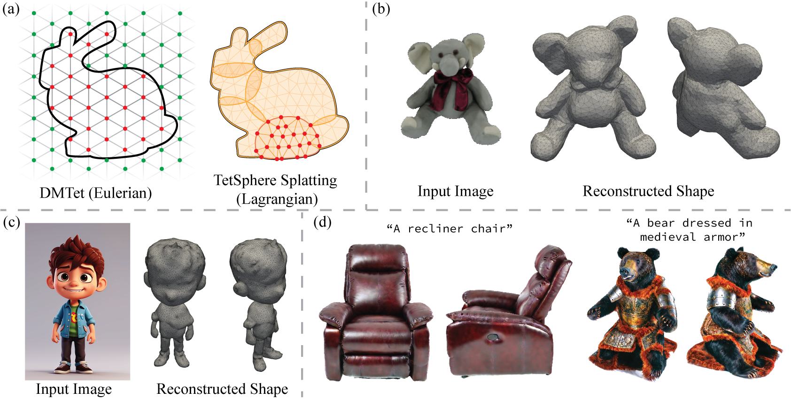

# TetSphere Splatting: Representing High-Quality Geometry with Lagrangian Volumetric Meshes
This repository contains the implementation code for the paper [TetSphere Splatting: Representing High-Quality Geometry with Lagrangian Volumetric Meshes](https://arxiv.org/pdf/2405.20283).

In this work, we introduce *TetSphere splatting*, an explicit, Lagrangian representation for reconstructing 3D shapes with high-quality geometry, which employs tetrahedral meshes as the geometric primitives. This approach directly yields superior mesh quality without relying on neural networks or post-processing. It deforms multiple initial tetrahedral spheres to accurately reconstruct the 3D shape by combining differentiable rendering and geometric energy optimization, resulting in significant computational efficiency.


(a) Eulerian vs. Lagrangian geometry representations: DMTet employs a deformable tetrahedral grid, assigning signed distance values at vertices, whereas TetSphere splatting reconstructs 3D shapes by directly deforming tet-spheres, enhancing computational and memory efficiency. TetSphere splatting supports a range of applications, including (b) single-view 3D reconstruction from Google Scanned Objects dataset, (c) SDS-based image-to-3D generation, and (d) text-to-3D generation.

## Installation

### Prerequisites
- __CUDA:__ We use ``cuda-11.8`` for both PyTorch and TetSphere geometry energies. Please install the corresponding CUDA version on your machine following this [link](https://developer.nvidia.com/cuda-11-8-0-download-archive). The default install path is ``/usr/local/cuda-11.8/``. If you don't have ``sudo`` permission, you can install it in your custom directory by using the ``runfile(local)`` installer (only install ToolKit w/o Driver, change ToolKit Install Path to a custom directory, disable the symbolic link creation, desktop shortcuts, and manpage documents in ToolKit Options).

- __TetWild:__ We use [TetWild](https://github.com/Yixin-Hu/TetWild) during the initialization of TetSpheres and merge the optimized TetSpheres into one shape. Clone from the following forked repository which offers the feature of turning generated tetmeshes into ``.npy`` and build it.
```bash
git clone git@github.com:gmh14/TetWild.git
cd TetWild
mkdir build && cd build
cmake ..
make -j
```

### Conda Environment
We use ``conda`` to install the dependencies for *TetSphere splatting*.
```bash
git clone git@github.com:gmh14/tssplat.git
cd tssplat
conda create --name tssplat python=3.10
conda activate tssplat
export CUDA_HOME=/usr/local/cuda-11.8
bash install.sh
```
> Replace ``CUDA_HOME`` with your custom CUDA path if you installed it in a different directory.

> The ``install.sh`` script contains the installation of multiple packages and libraries that are built from scratch. This is recommended for its robustness and ability to avoid package conflicts across all platforms we have tested. However, please note that installing all dependencies may require significant time.

We use the custom CUDA extension of TetSphere splatting for geometry energy computation and optimization, as it is significantly faster in wall-clock speed compared to the vanilla PyTorch version.
To use this extension, we need [libpgo](https://github.com/bohanwang/libpgo), a C++ library with Python bindings for **P**hysically-based simulation, **G**eometric shape modeling, and **O**ptimization. Follow the instructions in the original [repo](https://github.com/bohanwang/libpgo) to get ``libpgo`` installed inside the conda environment of ``tssplat`` we just created.

With ``libpgo`` installed, the custom CUDA extension is built with the following additional steps:
```bash
cd tssplat_ext
bash install_ext.sh
```
Once the extension is installed correctly, run ``export LD_LIBRARY_PATH=${CUDA_HOME}/lib64:$LD_LIBRARY_PATH && python test_ext.py``. The expected result will be
```bash
tet_spheres_ext imported successfully
```

## Use TetSphere Splatting

### Data Preparation
The input data for TetSphere splatting consists of multi-view RGBA images (optionally including depth/normal images) and their corresponding camera poses. We provide example data folders in this [link](https://drive.google.com/file/d/1j0hRu7vtBG3gb1p3BS_88YyVf9K9lhPk/view?usp=sharing), including examples from multi-view images obtained from both [Wonder3D](https://github.com/xxlong0/Wonder3D) and image-to-3D generation ([DreamCraft3D](https://github.com/DSaurus/threestudio-dreamcraft3D)).
Download the data from the link and unzip it into the ``img_data/`` folder. 

To create your own data, use [Mitsuba3](https://github.com/mitsuba-renderer/mitsuba3) for rendering images from a 3D shape. Check the example script ``render_dataset.py`` under the ``data/`` folder to understand the required format of input data, which should match the provided example data. The following steps render multi-view images for the GSO Mario model and save them to ``img_data/mario/`` (the paths are hard-coded in the Python file):
```bash
cd data
python render_dataset.py
cd ..
```

### TetSphere Initialization
```bash
export CUDA_HOME=/usr/local/cuda-11.8
export LD_LIBRARY_PATH=${CUDA_HOME}/lib64:$LD_LIBRARY_PATH

cd data
export expr_name=a_white_dog
python generate_init_spheres.py \
    --img_path ../img_data/$expr_name \
    --expr_name $expr_name \
    --save_path ../mesh_data/$expr_name \
    --rendering_type mistuba
cd ..
```
Replace ``expr_name`` with the folder name in ``img_data/``containing the input images. The script will generate the radii and center positions of initial TetSpheres and save them in the ``mesh_data/`` folder as ``.json`` files. The candidate points and the coarse voxel grid (represented using surface mesh w/ Marching Cubes) are also saved in the corresponding ``mesh_data/`` folder as ``.obj`` files.

Other parameters:
- ``radius_scale``: the scale factor for the initial radius of TetSpheres (default: 1.1).
- ``offset``: the offset for the initial center of TetSpheres (default: 0.06).
- ``surf_res``: the grid resolution of coarse voxel grid (default: 50).
- ``pc_res``: the grid resolution controlling the number of initial candidate points (default: 50).

> Increase both ``surf_res`` and ``pc_res`` for higher resolution and more accurate initialization. However, this will increase the computational cost.

> The implementation is slightly different from the paper: here, we use ``scipy.milp`` following the official implementation of [Coverage Axis](https://github.com/Frank-ZY-Dou/Coverage_Axis). Our original implementation is based on ``Gurobi`` and requires academic licenses for large-scale MILP optimization, which cannot be acquired for non-academics. In practice, we find that the current implementation performs similarly to the original one. 

### Run TetSphere Splatting
```bash
export CUDA_HOME=/usr/local/cuda-11.8
export LD_LIBRARY_PATH=${CUDA_HOME}/lib64:$LD_LIBRARY_PATH
python trainer.py --config ./config/img_to_3D.yaml \
    expr_name=$expr_name \
    geometry.tetwild_exec=**/path/to/tetwild**
```
Replace ``**/path/to/tetwild**`` with the path to the TetWild executable. The script will optimize the TetSpheres to reconstruct the 3D shape and save the intermediate and final results in the ``results/`` folder.

We only use RGBA images for the TetSphere splatting when dense view images are provided (with ``expr_name`` in ``a_white_dog``, ``camel``, ``horse``, ``cartoon_man``, ``mario``).

## Result Visualization
We provide Colab for visualizing the intermediate results of TetSphere splatting, which can be found [here](https://colab.research.google.com/drive/1uMDDjNeweicOXXuVgH2xq6eMIC4Eo61U?usp=sharing).

Visualizing the results locally using modeling tools like MeshLab or Blender is recommended to show better quality and details. Some results are shown in [here](https://github.com/gmh14/tssplat/tree/master/assets).

## WIP Features
- [ ] Wonder3D examples

- [ ] Text-to-3D threestudio plugin

- [ ] Vanilla PyTorch version of TetSphere geometry energies

- [ ] HuggingFace Gradio app 


## Acknowledgements
Implementing *TetSphere splatting* is partly based on [threestudio](https://github.com/threestudio-project/threestudio).


## Citation
If you find the idea or code useful for your research, please cite [our paper](https://arxiv.org/pdf/2405.20283):
```bib
@article{guo2024tetsphere,
  title={TetSphere Splatting: Representing High-Quality Geometry with Lagrangian Volumetric Meshes},
  author={Guo, Minghao and Wang, Bohan and He, Kaiming and Matusik, Wojciech},
  journal={arXiv preprint arXiv:2405.20283},
  year={2024}
}
```


## Contact
Don't hesitate to contact guomh2014@gmail.com if you have any questions. Enjoy!
